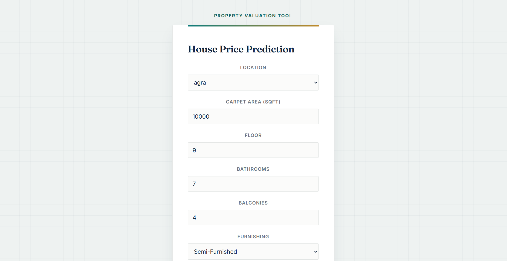
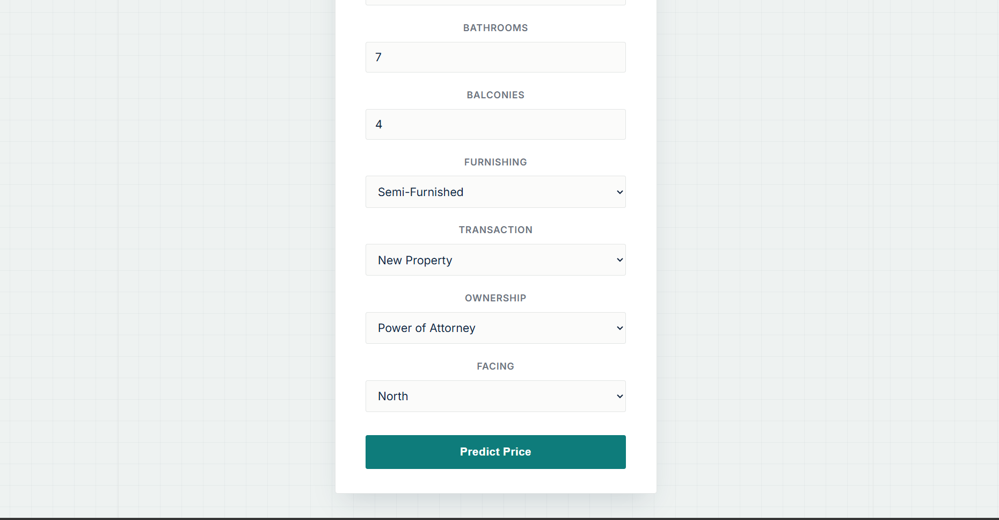
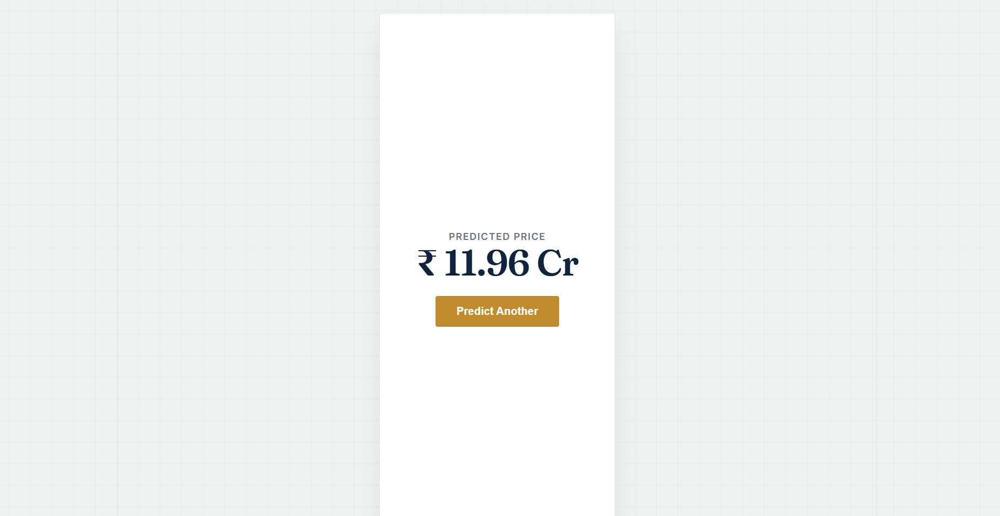

## Dataset

**Source:** [House Price dataset by Juhi Bhojani](https://www.kaggle.com/datasets/juhibhojani/house-price) on Kaggle (~187,000 real property listings from India).

### Download instructions

```bash
pip install kaggle
# Get your API token from Kaggle → Settings → API → "Create New Token"
kaggle datasets download -d juhibhojani/house-price -p notebooks/data --unzip
```

The raw CSV is not committed to this repository (too large). Download it using the command above before running the notebook.

## Setup & Running Locally

### Prerequisites
- Python 3.12+
- Node.js 18+
- Git

### 1. Notebook (optional — model is already trained and exported)

```bash
python -m venv .venv
.venv\Scripts\activate          # Windows
pip install jupyter pandas numpy scikit-learn matplotlib seaborn
jupyter notebook
```

Open `notebooks/house_price_model.ipynb` and run all cells top to bottom.

### 2. Backend

```bash
cd backend
python -m venv .venv
.venv\Scripts\activate
pip install -r requirements.txt
uvicorn app.main:app --reload
```

The API will be available at `http://localhost:8000`. Interactive docs at `http://localhost:8000/docs`.

### 3. Frontend

```bash
cd frontend
npm install
npm run dev
```

The app will be available at `http://localhost:5173`.

## Environment Variables

### Backend (`.env`)

| Variable | Description | Default |
|---|---|---|
| `MODEL_PATH` | Path to the trained model file | `models/house_price.pkl` |
| `LOCATIONS_PATH` | Path to the allowed locations list | `models/locations.json` |
| `CORS_ORIGINS` | Allowed frontend origins | `["http://localhost:5173"]` |

### Frontend (`.env`)

| Variable | Description | Default |
|---|---|---|
| `VITE_API_BASE_URL` | Backend API base URL | `http://localhost:8000` |

## API Reference

### `GET /health`
Returns the API status.

```bash
curl http://localhost:8000/health
```

Response:
```json
{"status": "ok"}
```

### `POST /predict`
Returns a predicted price for the given property details.

```bash
curl -X POST http://localhost:8000/predict \
  -H "Content-Type: application/json" \
  -d '{
    "location": "thane",
    "carpet_area_sqft": 1000,
    "floor_num": 3,
    "bathroom": 2,
    "balcony": 1,
    "furnishing": "Semi-Furnished",
    "transaction": "Resale",
    "ownership": "Freehold",
    "facing": "East"
  }'
```

Response:
```json
{"predicted_price": 1542708.72}
```

## Model Performance

Two models were trained and compared on a held-out test set (20% of the cleaned data):

| Model | MAE (₹) | RMSE (₹) | R² |
|---|---|---|---|
| Linear Regression | 4,171,524 | 6,659,685 | 0.7494 |
| **Random Forest (chosen)** | **1,146,884** | **3,565,063** | **0.9282** |

The Random Forest model was selected as the final model. It explains roughly 93% of the variance in property prices and achieves a substantially lower prediction error than the linear baseline, since it can capture non-linear relationships and interactions between features (such as location and area) that a linear model cannot.

## Screenshots

### Prediction form



### Prediction result


## Testing

Backend tests can be run with:

```bash
cd backend
pytest
```

This covers the health check endpoint, a valid prediction request, and invalid input handling (422 response).